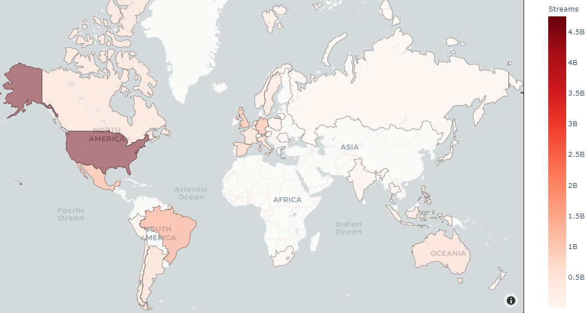
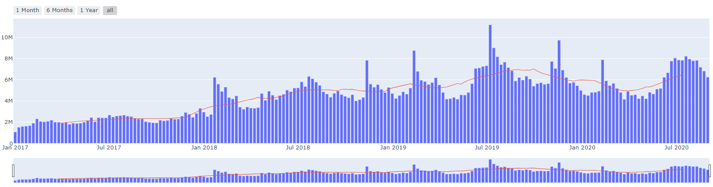
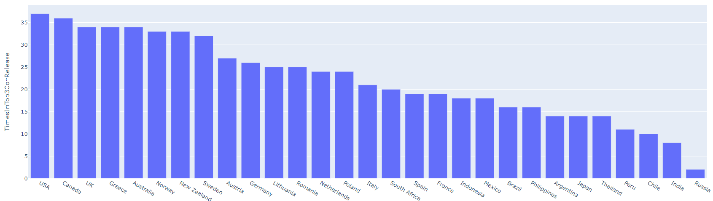
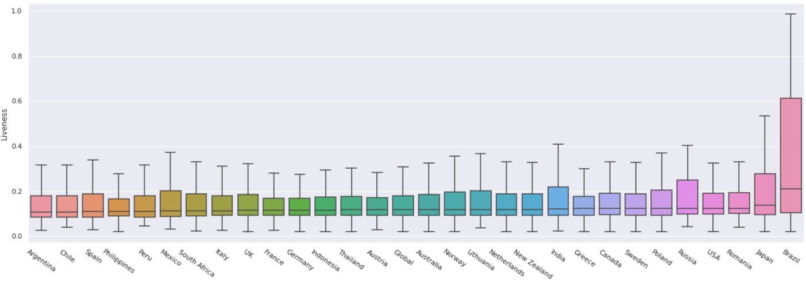
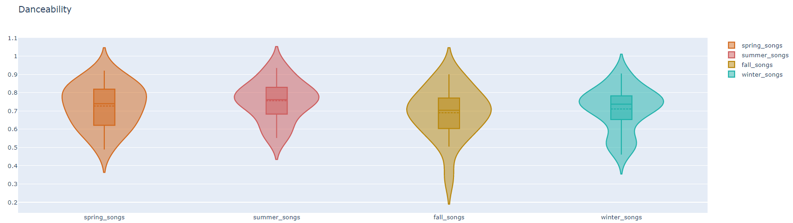

# Spotify Top30 Analysis
For the "**Data and Results Visualization**" exam we had to present a project to show we were able to find some interesting patterns using the visualization techniques explained in the course.

The first step of the project was to find the right dataset in order to achieve the goal; we liked the idea of scraping the **Spotify** data about top charts around the world using the provided API, so we decided to build a dataset composed by the **top 30** charts of 30 different countries between 2017 and 2020 (we have different top 30 each week).

  

Selected what type of data we will work with we decided to divide the notebook to present at the exam in 5 main sections:

1. **Building the Dataset**: In this step we scraped the data using the API provided by Spotify and we merged the data about the charts with the data about the attributes that Spotify gives to the songs (Danceability, Energy, Liveness, ...), usefull for further analysis.

2. **Data Exploration**: In this step we explored the dataframe we have built using some visualizations of different types (2 examples are following).

  

  

3. **Spread Analysis**: In this section we performed an analysis about the spread around the world of the songs.

  

4. **Country-Features Study**: Here we tried to find some patterns between the musical attributes of the songs and the country of them (we found that in Brazil a lot of "live" songs enter the top 30!)

  

5. **Season-Features Study**: Here, on the contrary, we tried to find some patterns dividing the songs depending on the season they entered in the charts (a comparison about Danceability using violin plots follows).

  

***

Be sure to check the notebook in order to read and to visualize all the work done by the team!

The team was composed by:
- [Meta Samuele](https://github.com/SamueleMeta)
- [Metaj Stiven](https://github.com/StivenMetaj)
- [Salamino Manuel](https://github.com/manuelsalamino)
- [Serna Giuseppe](https://github.com/armando2603)
